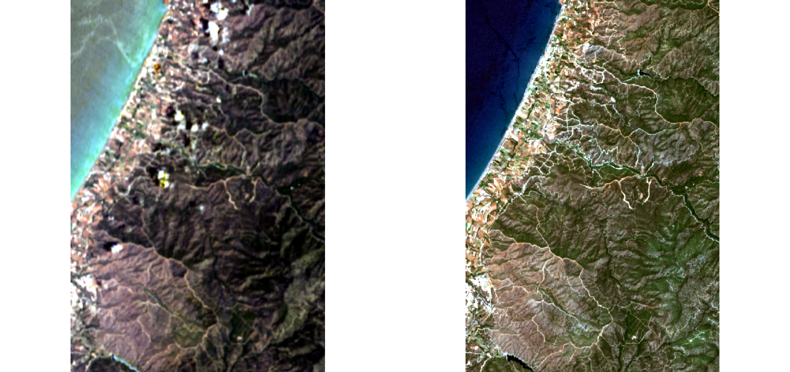
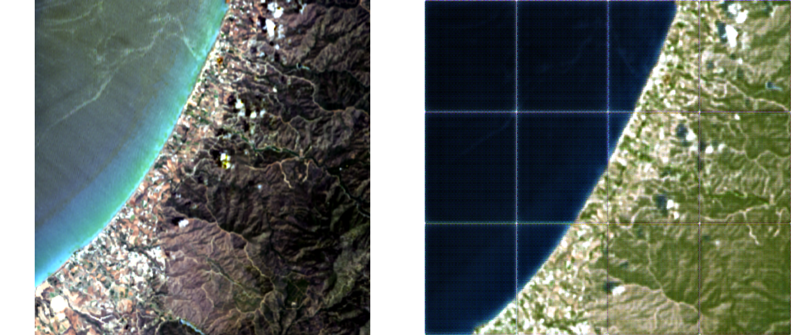

# multisensoR

<!-- badges: start -->

<!-- badges: end -->

**multisensoR** is an R package for deep-learning-based image translation from
Landsat-8 to Sentinel-2 using a U-Net architecture. Given image
pairs, it learns to map Landsat-8 reflectance to Sentinel-2 reflectance, for temporal gap-filling. The package is rather experimental right now and results do not seem to be helpful at the moment.
Right now the package resamples Landsat data (30m) to the Sentinel-2 grid (10m) before training. This is probably a cause for the limited performance as the resampling creates information in the Landsat scene that might not exist.


*Example Landsat-8 / Sentinel-2 pair from the sample data (`inst/extdata/subsamples/`): Landsat-8 30 m input (left) and Sentinel-2 10 m target (right), RGB true colour, pair\_01.*

## Installation

```r
# install.packages("remotes")
remotes::install_github("kwundram2602/multisensoR")

# PyTorch backend (restart R session if prompted)
if (!torch::torch_is_installed()) torch::install_torch()
```

## Workflow

The package covers four steps at the moment:

| Step | Function | Description |
|------|----------|-------------|
| 1 | `find_l8_s2_pairs()` | Match Landsat-8 and Sentinel-2 file pairs |
| 2 | `preprocess_pairs()` | Scale DN → reflectance [0, 1], align grids, harmonise NoData |
| 3 | `landsat_sentinel_dataset()` + `train_unet()` | Build a patch dataset and train the U-Net |
| 4 | `predict_unet()` | Run inference on a new Landsat-8 scene |


## Demo

A complete end-to-end example using the sample data is provided in
[demo/train_and_predict.R](demo/train_and_predict.R).

```r
library(multisensoR)
library(terra)

# --- locate sample data ---
data_s2 <- system.file("extdata/subsamples/S2", package = "multisensoR")
data_l8 <- system.file("extdata/subsamples/L8", package = "multisensoR")
out      <- file.path(getwd(), "ms_out")

# --- find pairs ---
pairs <- find_l8_s2_pairs(data_l8, data_s2, n_pairs = 4)

# --- preprocess (scale + align) ---
# Scaling to [0, 1]
pairs_proc <- preprocess_pairs(pairs,
                               out_dir  = file.path(out, "preprocessed"),
                               scale_l8 = c(gain = 0.0000275, offset = -0.2),
                               scale_s2 = c(gain = 1/10000,   offset = 0))

# --- dataset + dataloader ---
ds       <- landsat_sentinel_dataset(pairs_proc$l8, pairs_proc$s2,
                                     patch_size = 256, augment = TRUE)
train_dl <- torch::dataloader(ds, batch_size = 1, shuffle = TRUE)

# --- train ---
model   <- unet_model(in_channels = 6L, out_channels = 6L)
history <- train_unet(model, train_dl, epochs = 5,
                      checkpoint_dir = file.path(out, "checkpoints"))

# --- predict ---
pred <- predict_unet(
  model_path   = tail(list.files(file.path(out, "checkpoints"), full.names = TRUE), 1),
  landsat_path = pairs_proc$l8[[1]],
  out_path     = file.path(out, "prediction_l8_to_s2.tif")
)
```

See [demo/train_and_predict.R](demo/train_and_predict.R) for the full script.

### Example output



*Model output on `pair_01`: Landsat-8 reflectance input (left) and the predicted Sentinel-2 reflectance (right), RGB true colour. The visible grid lines in the prediction are patching-artefacts. It seems the patching is a current limitation.*

## License

MIT © Kjell Wundram
